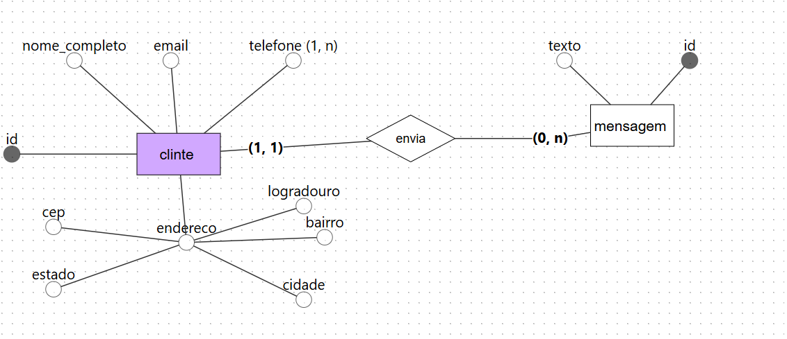

# confeitaria-sempre-doce-projeto-banco-de-dados
projeto do banco de dados para  confeitaria sempre doce
# Projeto de Banco de Dados

---

**Nome do projeto:** **Site da Confeitaria Sempre Doce**

**Equipe de desenvolvimento:** Maria

---

## 1. Visão Geral do Sistema (Escopo)

A **Confeitaria Sempre Doce** deseja expandir sua atuação criando um site para vender seus produtos. Estes são feitos com muito amor e carinho e mantendo a tradição de sua família.

---

## 2. Regras de Negócios (RN)

**RN01:** O sistema deve gerenciar o cadastro de seus clientes. As informações úteis que foram levantadas são:

* Nome completo
* Telefone
* E-mail
* Endereço:

  * Logradouro
  * Bairro
  * Estado
  * CEP
  * Cidade

---

**RF02:** O sistema deve permitir que o cliente envie uma mensagem com as informações do seu pedido. A mensagem será enviada via formulário do sistema, preenchendo os seguintes campos:

* Nome
* E-mail
* Telefone
* Endereço
* Texto da mensagem

##modelagem conceitual

